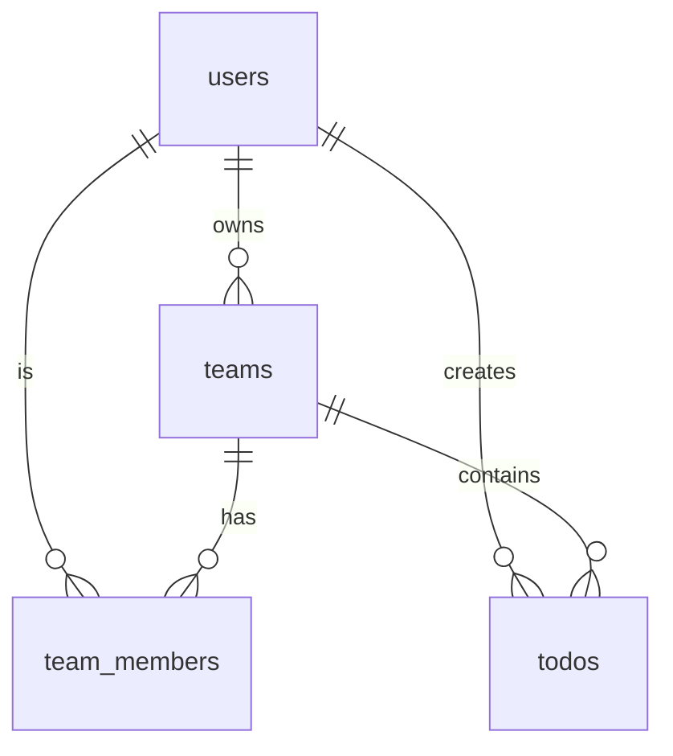

# Supabase를 활용한 팀 기반 Todo 앱

이 프로젝트는 Supabase를 활용하여 팀 기반의 할일 관리 기능을 구현한 예제입니다.

## 기술 스택

### Frontend
- [Next.js](https://github.com/vercel/next.js) - React 프레임워크
- [Tailwind](https://tailwindcss.com/) - 스타일링
- [Supabase.js](https://supabase.com/docs/library/getting-started) - 사용자 관리 및 실시간 데이터 동기화

### Backend
- [Supabase](https://supabase.com/dashboard) - PostgreSQL 데이터베이스 및 REST API

## 주요 기능

### 1. 개인 할일 관리
- 할일 추가/수정/삭제
- 완료 여부 토글
- 작성일 기준 정렬

### 2. 팀 관리
- 팀 생성 및 관리
- 팀원 초대 및 관리
- 팀별 할일 목록 관리
- 팀 멤버별 할일 작성 및 관리

## 데이터베이스 스키마

```sql
-- Teams table
create table teams (
  id bigint generated by default as identity primary key,
  name text not null check (char_length(name) > 2),
  owner_id uuid references auth.users not null,
  created_at timestamp with time zone default timezone('utc'::text, now()) not null
);

-- Team members table
create table team_members (
  id bigint generated by default as identity primary key,
  team_id bigint references teams not null,
  user_id uuid references auth.users not null,
  role text check (role in ('owner', 'member')),
  created_at timestamp with time zone default timezone('utc'::text, now()) not null,
  unique(team_id, user_id)
);

-- Todos table (with team support)
create table todos (
  id bigint generated by default as identity primary key,
  user_id uuid references auth.users not null,
  task text check (char_length(task) > 3),
  is_complete boolean default false,
  team_id bigint references teams,
  inserted_at timestamp with time zone default timezone('utc'::text, now()) not null
);
```

## Row Level Security (RLS) 정책

Supabase의 RLS를 활용하여 다음과 같은 보안 정책을 구현했습니다:

### Teams 테이블
- 모든 사용자가 팀을 생성할 수 있음
- 팀 멤버만 팀 정보를 조회할 수 있음
- 팀 소유자만 팀 정보를 수정/삭제할 수 있음

### Team Members 테이블
- 팀 소유자만 멤버를 추가할 수 있음
- 팀 멤버는 다른 멤버 목록을 조회할 수 있음
- 팀 소유자만 멤버를 제거할 수 있음

### Todos 테이블
- 개인 할일은 작성자만 접근 가능
- 팀 할일은 해당 팀의 멤버만 접근 가능
- 할일 수정/삭제는 작성자만 가능

## 데이터베이스 관계도



## 페이지 구조

1. `/` - 개인 할일 목록
2. `/teams` - 팀 관리
   - 팀 생성
   - 팀원 관리
3. `/teams/[id]` - 팀별 할일 목록
   - 팀 할일 추가/수정/삭제
   - 팀원별 할일 확인

## 주요 구현 내용

### 1. 팀 관리 기능

```typescript
// 팀 생성
export async function createTeam(name: string) {
  const { data: { user } } = await supabase.auth.getUser()
  if (!user) throw new Error('Not authenticated')

  const { data, error } = await supabase
    .from('teams')
    .insert({
      name,
      owner_id: user.id
    })
    .select()
    .single()

  if (error) throw error
  
  // 소유자를 팀 멤버로 자동 추가
  const { error: memberError } = await supabase
    .from('team_members')
    .insert({
      team_id: data.id,
      user_id: user.id,
      role: 'owner'
    })

  if (memberError) throw memberError

  return data
}

// 팀원 추가
export async function addTeamMember(teamId: number, email: string) {
  // 이메일로 사용자 찾기
  const { data: users, error: userError } = await supabase
    .from('users')
    .select('id')
    .eq('email', email)
    .single()

  if (userError) throw userError
  if (!users) throw new Error('User not found')

  // 팀 멤버로 추가
  const { error } = await supabase
    .from('team_members')
    .insert({
      team_id: teamId,
      user_id: users.id,
      role: 'member'
    })

  if (error) throw error
}
```

### 2. 팀별 할일 관리

```typescript
// 팀 할일 목록 조회
export async function getTeamTodos(teamId: number) {
  const { data, error } = await supabase
    .from('todos')
    .select(`
      *,
      user:user_id (
        email
      )
    `)
    .eq('team_id', teamId)
    .order('inserted_at', { ascending: false })

  if (error) throw error
  return data
}

// 팀 할일 추가
export async function createTeamTodo(teamId: number, task: string) {
  const { data: { user } } = await supabase.auth.getUser()
  if (!user) throw new Error('Not authenticated')

  const { data, error } = await supabase
    .from('todos')
    .insert({
      task,
      team_id: teamId,
      user_id: user.id
    })
    .select()
    .single()

  if (error) throw error
  return data
}
```

## 배포

이 프로젝트는 Vercel을 통해 배포되었으며, Supabase 프로젝트와 연동되어 있습니다.

### 환경 변수 설정

```bash
NEXT_PUBLIC_SUPABASE_URL=your-project-url
NEXT_PUBLIC_SUPABASE_ANON_KEY=your-anon-key
```

## 앞으로의 개선 사항

1. 실시간 업데이트 구현
   - Supabase의 실시간 구독 기능을 활용하여 팀 할일 목록 실시간 동기화
2. 팀 권한 관리 개선
   - 관리자 역할 추가
   - 팀원별 권한 설정 기능
3. 할일 분류 및 정렬
   - 태그 기능 추가
   - 다양한 정렬 옵션 제공